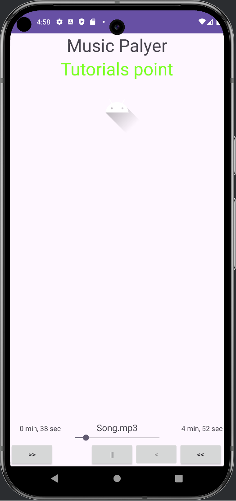

Simple Music Player App

A basic music player app developed for a class project. This app allows users to play, pause, and navigate through a song using a simple and user-friendly interface.

Features

    Play Music: Plays an audio file.
    Pause Music: Pauses the currently playing music.
    Navigation: Skip forward, skip backward, or rewind using navigation buttons.
    Progress Bar: Displays the current position in the audio track.

Requirements

    Android Studio (for running or editing the project)
    Android SDK 21 or above

How to Use

    Clone this repository to your local machine.
    Open the project in Android Studio.
    Build and run the app on an emulator or a physical device.

Screenshot

License

This project is for educational purposes and is open for use and modification.
